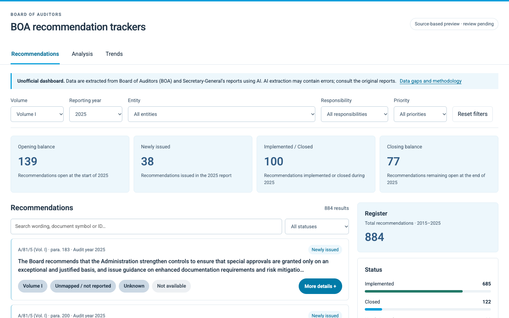

# BOA recommendation trackers

United Nations Board of Auditors recommendations are spread across reports and years, making their follow-up difficult to trace. This unofficial dashboard brings together **1,360 recommendations from 55 source reports** covering the available 2015–2025 audit years. On the live site, you can search and filter recommendations, inspect status changes and trends, and open citations to the original reports.

**[Open the dashboard](https://henrisalomon.github.io/BOA-recommendation-trackers/)**



Data were extracted with AI and remain subject to human review. Check the cited reports before relying on a recommendation or status; see the [data gaps](website/DATA_GAPS.md) for coverage limits. This independent project is not affiliated with or endorsed by the United Nations.

## Explore the project

- [Dashboard and data documentation](website/README.md)
- [Validation notes](website/VALIDATION.md)
- [Data gaps and limitations](website/DATA_GAPS.md)
- [Published data dictionary](website/data/DATA_DICTIONARY.md)

## Local development

From the repository root, run:

```sh
python3 -m http.server 4173 --bind 127.0.0.1 --directory website
```

Then open <http://127.0.0.1:4173/>. The dashboard needs HTTP to load its local JSON files. See the [website documentation](website/README.md) for data updates, tests and the manual GitHub Pages publishing workflow.
